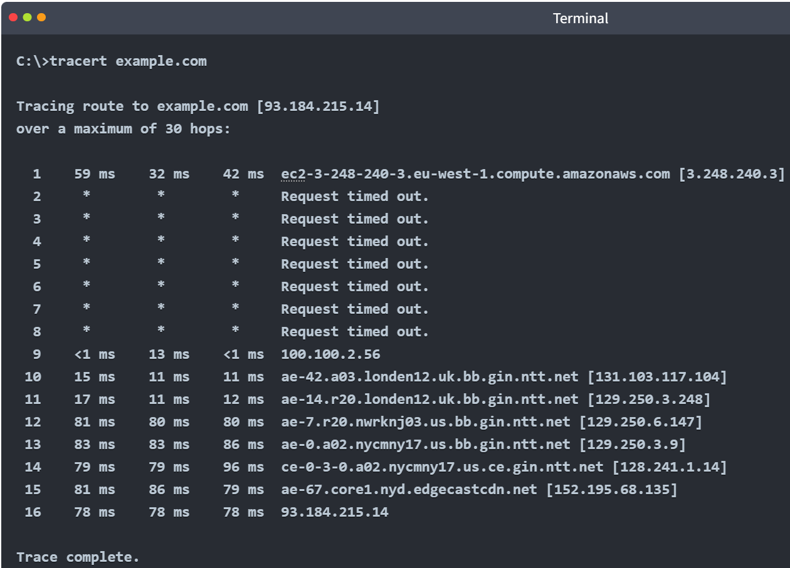

Last Updated: 10th July, 2025

**My Cybersecurity_Journey**
My TryHackMe notes and progress throught the Complete Beginner Path

Welcome! This repository documents my selef taught, hands-on learning and progress through the 'TryHackMe Complete Beginner Path' up to and including the 'Cryptography Basics' module.

---

🌐 
**Platform: TryHackMe - https://tryhackme.com**
Username: DHDCSAI  
Path: Security Analyst
Progress: ✅ Completed up to "Cryptography Basics"  

---

📚 
**Learning Path Summary**

I have been actively working through TryHackMe’s beginner-friendly cybersecurity curriculum. The labs are practical, hands-on and designed to teach real-world defensive and offensive security skills.

**************************************************
**Pre Security** - ✅ Currently Completed Modules
**************************************************

**1. Introduction to Cyber Security**
- Offensive Security Intro
- Defensive Security Intro
- Careers in Cyber

**2. Network Fundamentals**
- What is Networking?
- Intro to LAN
- OSI Model
- Packets & Frames
- Extending Your Network

**3. How the Web Works**
- DNS in Details
- HTTP in Detail
- How Websites Work
- Putting it all together 

**Linux Fundamentals**
- Linux Fundamentals Part 1 - 3

**Windows Fundamentals**
- Windows Fundamentals 1 -3
  
************************************
**Cyber Security 101**
************************************
**1. Start Your Cyber Security Journey**
- Offensive Security Intro
- Defensive Security Intro (Intro to defensive security and related topics such as Threat Intelligence, SOC, DFIR, Malware Analysis and SIEM)
- Search Skills (Learn to efficiently search the internet and use specialised search engines and technical documents)
  
**2. Linux Fundamentals**
- Linux Fundamentals Part 1 (Essential Commands on an interactive terminal)
- Linux Fundamentals Part 2 (Learn to log in to a Linux machine using SSH)
- Linux Fundamentals Part 3 (Hands-on experience with utilities)

**3. Windows and Active Directory Fundamentals**
- Windows Fundamentals 1 (File/Folder Permissions, Local User & Group Management, User Account Control) 
- Windows Fundamentals 2 (System Configuration, UAC Settings, Resource Monitoring, Windows Registry, Windows Management Instrumentation) 
- Windows Fundamentals 3 (Windows Updates, Windows Security, BitLocker, VSS)
- Active Directory Basics (Managing Users & Computers, Group Policies, Authentication Methods, Trees-Forests-Trusts) 

**4. Command Line**
- Windows Command Line (Network Troubleshooting, File & Desk Management, Task & Process Management) 
- Windows PowerShell (System & Network Information, Real-Time System Analysis, Scripting) 
- Linux Shells (Shell Scripting & Components)  

**5. Networking**
- Networking Concepts (Learn the ISO OSI model and the TCP/IP protocol suite)
- Networking Essentials (Exploring automatic configuration to routing packets to the destination) 
- Networking Core Protocols (Learn about the core TCP/IP protocols)
- Networking Secure Protocols (Learn how TLS, SSH & VPN, can secure your network traffic)
- Wireshark: The Basics (Learn how to analyse protocols and PCAPs)
- TCPdump: The Basics (Use TCPdump to save, filter and display packets)
- Nmap: The Basics (Use Nmap to discover live hosts, find open ports and detect service versions)

**6. Cryptography**
- Cryptography Basics (Basic crypography & symmetric encryption, Caesar cipher)
- Public Key Cryptography Basics (Discover how public key ciphers such as RSA work & explore their role in applications such as SSH)
- Hashing Basics (Hashing Functions and their uses in password verification & file integrity checking)
- John the Ripper: The Basics (Learn adaptable hash-cracking tools)

<!--
**7. Exploitation Basics**
- Moniker Link (CVE-2024-21413) (Leak user's crednetials using CVE to bypass Outlook's Protected View)
- Metasploit: Introduction (Frameworks)
- Metasploit: Exploitation (Scanning, Vulnerability assessment and exploitation)
- Metasploit: Meterpreter (How in-memory payloads can be used for post-exploitation)
- Blue (Deploy & hack into a Windows machine, leveraging common misconfiguration issues)

**8. Web Hacking**
- Web Application Basics (HTTP, URLs, request methods, response codes and headers)
- JavaScript Essentials (Add interactivity to a website and understand associated vulnerabilities)
- SQL Fundamentals (Perform basic SQL queries to retrieve and manage data in a database)
- Burp Suite: The Basics (Using Bupr Suite for web application pentesting)
- OWASP Top 10-2021 (Learn & exploit each of the OWASP Top 10 vulnerabilities; the 10 most critical web security risks.

**9. Offensive Security Tooling**
- Hydra (Learn about the fast network logon cracker to bruteforce and obtain a website's credentials)
- Gobuster: The Basics (Learn enumeration)
- Shells Overview (Learn different types of shells)
- SQLMap: The Basics (Learn SQL injection and exploit this vulnerability through the SQLMap tool)

**10. Defensive Security**
- Defensive Security Intro
- SOC Fundamentals (Learn the SOC team processes)
- Digital Forensics Fundamentals (Learn digital forensics processes and experiment with a practical example)
- Incident Response Fundamentals (Perform IR in cyber security)
- Logs Fundamentals (Learn how to analyse logs for effective investigation.

**11. Security Solutions**
- Introduction to SIEM
- Firewall Fundamentals (Hands-on experience with Windows and Linux built-in firewalls)
- IDS Fundamentals (Learn IDs with experience in Snort)
- Vulnerability Scanner Overview

**12. Defensive Security Tooling**
- CyberChef: The Basics
- CAPA: The Basics (Identify malicious capabilities)
- REMnux: Getting Started (Use REMnux VM)
- FlareVM: Arsenal of Tools

**Build you Cyber Security Career**
- Security Principles
- Careers in Cyber
- Training impact on teams

-->
---

## 🧰 Tools Used on completion

- **Linux CLI** (Ubuntu/Kali)
- **Nmap**, **Wireshark**, **Hydra**, **Burp Suite**, **Metasploit**
- **CyberChef**, **John the Ripper**, **Hashcat**
- Online tools: base64 decode, ROT13, hash identifier, .

---

## 📁 Structure of This Repo

This GitHub repo includes:
- Notes and summaries (Markdown files)
- Screenshots from completed rooms (where allowed)
- Scripts and payloads used in labs
- Writeups for key rooms (public ones only, no flags or spoilers)

> ⚠️ **Note:** I strictly follow TryHackMe’s rules — no walkthroughs with answers or flags are shared.

---

## 🧗‍♂️ Next Steps

I’m continuing my path toward:
- Full completion of the TryHackMe Cyber101 and SOC Level 1 Paths
- Deepening skills in **penetration testing**, **network analysis**, and **cyber defense**
- Studying toward **CompTIA A+ & Security+** and **eJPT** (future goals)

---

## 💼 Career Goals

I'm actively pursuing a career in cybersecurity, starting in roles like:
- **Junior SOC Analyst**
- **IT Support with a Security Focus**
- **Cybersecurity Trainee / Apprentice**

---
<!--
- **LinkedIn:** [Your LinkedIn URL]
- **TryHackMe Profile:** [<iframe src="https://tryhackme.com/api/v2/badges/public-profile?userPublicId=4958181" style='border:none;'></iframe>]
- **Email:** [Optional]

Let’s connect if you’re in cybersecurity or hiring for entry-level roles in the UK!
-->

---

“Give a man a zero-day and he’ll pwn for a day. Teach a man to phish, and he’ll pwn for a lifetime.” – Some wise hacker, probably behind 7 proxies.
